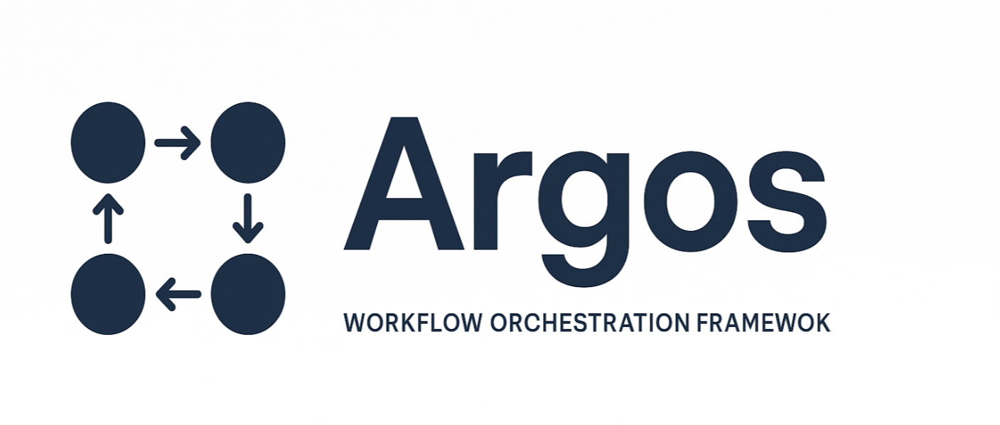

# Argos



Orchestrate your workflows effortlessly. ***Anywhere.***

## What is Argos?

Argos is a modern workflow orchestration tool designed to streamline and automate complex processes across various execution environments. Whether you're managing data pipelines, automating deployments, or coordinating tasks across distributed systems, Argos provides a unified platform to define, execute, and monitor your workflows with ease and reliability.

## What does Argos do?

Argos abstracts the complexities of different execution backends, allowing you to *define your workflows once and run them anywhere* without modification. It ensures consistency, scalability, and flexibility, empowering developers and organizations to automate their operations efficiently.

## Features

- Define workflows once, run on multiple backends (in-memory, Temporal, Celery, etc.)  
- Simple client API for defining and running workflows  
- Plugin system for adding custom tasks and operations  
- Real-time monitoring and logging  
- Built-in support for dependencies, retries, and error handling  

## Quick Start

See [example.py](example.py) for a complete example.

1. Define a Plugin

Plugins extend Argos by implementing execute.
Each plugin declares a plugin_name so workflows can reference it.

```python
import argos

class SayHelloPlugin(argos.PluginMixin):
    plugin_name = "say_hello"

    def execute(self, name: str) -> str:
        return f"Hello, {name}!"
```

2. Create a client and register your plugin(s)

```python
client = argos.create(argos.BackendType.IN_MEMORY)
client.plugin(SayHelloPlugin)
```

3. Define a workflow

```python
workflow = {
    "steps": [
        {
            "id": "step1", # unique step id
            "kind": "operation",
            "operation": "say_hello", # plugin_name
            "parameters": {"name": "Argos"},
        },
    ]
}
```

4. Execute the workflow

```python
from argos import WorkflowResult

result: WorkflowResult = client.run(workflow)

# View the results however you like
print(result.to_dict())
print(result.to_json())
print(result.to_yaml())
```

Example Output (YAML):

```yaml
id: workflow
status: success
results:
- id: step1
  kind: operation
  operation: say_hello
  parameters:
    name: Ari
  result: Hello, Ari!
  status: success
  error: null
error: null
```

## Further Reading

Argos can do more than just basic workflows.

- Map a plugin over a list of items (in sequence or in parallel)

```python
# Example: Map "say_hello" over a list of names
{
    "steps": [
       {
            "id": "step1",
            "kind": "map",
            "inputs": ["a", "r", "g", "o", "s"],
            "iterator": "item",
            "mode": "parallel", # or "sequential"
            "operation": {
                "id": "step1_op",
                "kind": "operation",
                "operation": "say_hello",
                "parameters": {"name": "{{item}}"},
            },
        },
    ]
}
```

- Execute steps in parallel

```python
  # Example: Two steps running in parallel
{
    "steps": [
        {
            "id": "step1",
            "kind": "parallel",
            "operations": [
                {
                    "id": "step1_op1",
                    "kind": "operation",
                    "operation": "say_hello",
                    "parameters": {"name": "Argos A"}
                },
                {
                    "id": "step1_op2",
                    "kind": "operation",
                    "operation": "say_hello",
                    "parameters": {"name": "Argos B"}
                },
            ],
        },
    ]
}
```

- Chain results to other steps

```python
# Example: Use result from step1 as input to step2
{
    "steps": [
        {
            "id": "step1",
            "kind": "operation",
            "operation": "say_hello",
            "parameters": {"name": "Ari"}
        },
        {
            "id": "step2",
            "kind": "operation",
            "operation": "say_hello",
            "inputs": {"name": "${step1.result}"}
        }
    ]
}
```

---

## Roadmap

### Backends

- [ ] In-memory (in-development)
- [ ] Temporal (planned)
- [ ] Celery (planned)
- [ ] AWS Step Functions (planned)
- [ ] Azure Durable Functions (planned)
- [ ] File Based (planned)
